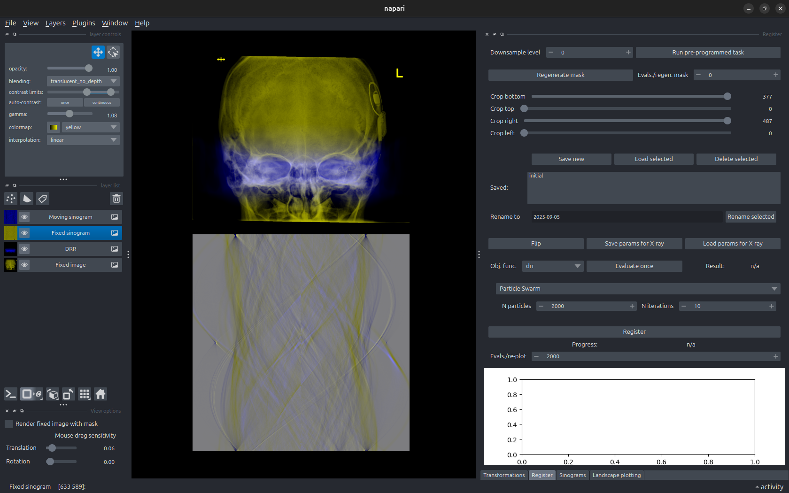
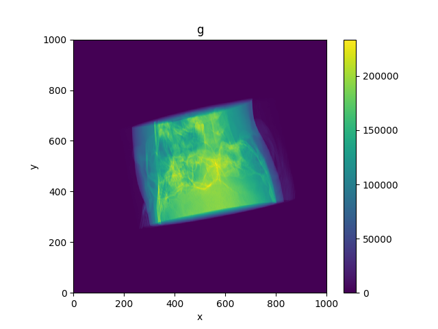
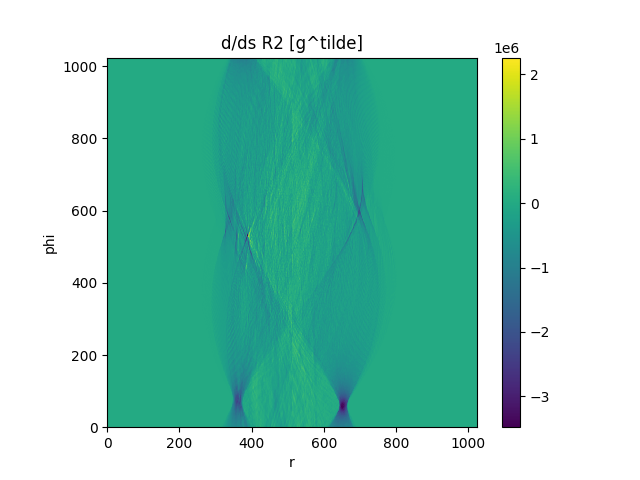
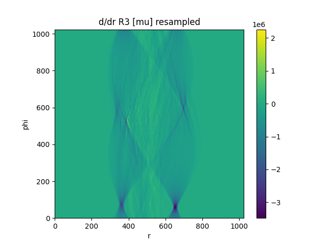
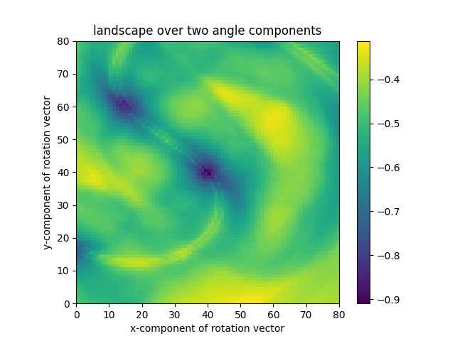
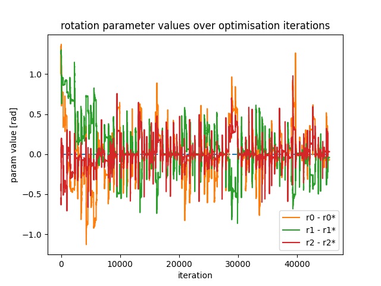
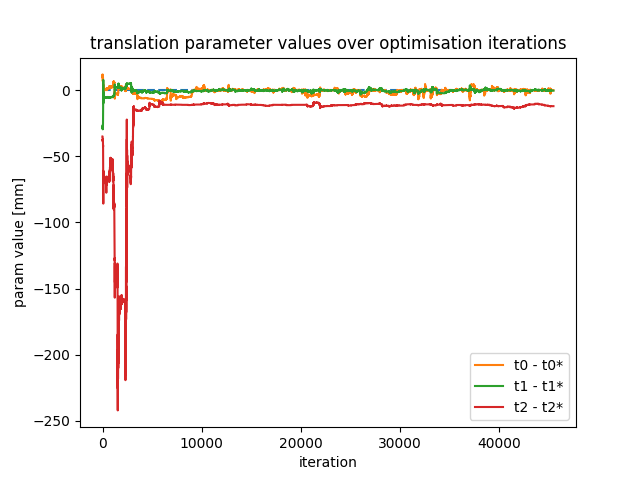
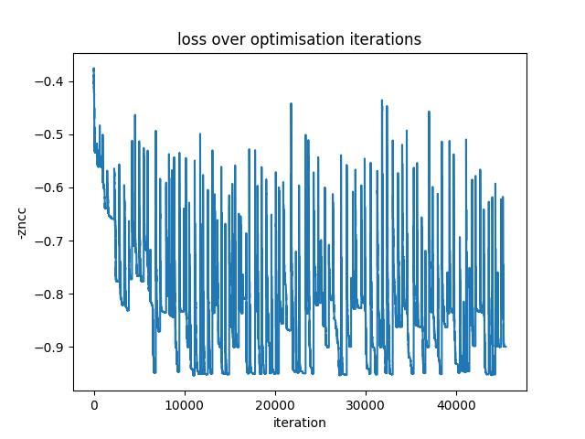
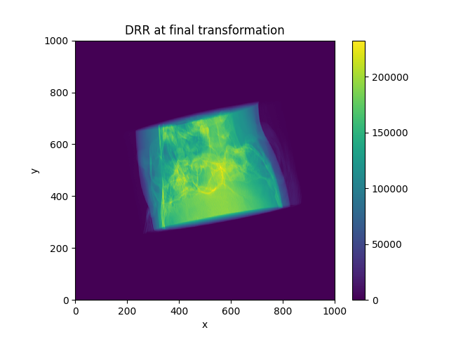
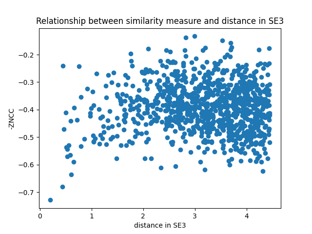

# A PyTorch extension for fast 2D/3D radiographic image registration using Grangeat's relation

### Documentation

Documentation for the python libraries in this repo, as well as for the `reg23` library, can be found here:

[https://ewoprager.github.io/grangeat-2d-3d-register-pytorch/](https://ewoprager.github.io/grangeat-2d-3d-register-pytorch/)

The registration method using Grangeat's relation is from this paper:

Frysch R, Pfeiffer T, Rose G. A novel approach to 2D/3D registration of X-ray images using Grangeat's relation. Med
Image Anal. 2021 Jan;67:101815. doi: 10.1016/j.media.2020.101815. Epub 2020 Sep 30. PMID: 33065470.

This project is very much in the experimental stages, so none of the code is very usable yet. It is being actively
developed as part of a PhD.

# Repo contents

```text
.
├── reg23/                      # A Python package with custom C++/CUDA operators for PyTorch
│   ├── include/reg23/          # Header files shared by all operator implementations
│   ├── src/                    # 
│   │   ├── cpu/                # C++ source files used for CPU implementations of operators
│   │   ├── cuda/               # CUDA source files used for CUDA implementations of operators
│   │   └── main.cpp            # Declares all bindings for operators of all implementations
│   ├── tests/                  #
│   ├── README.md               #
│   ├── mainpage.md             #
│   ├── Conventions.md          # Contains details of C++ coding conventions, regarding style and structure.
│   ├── pyproject.toml          # The project configuration file used by `uv` to setup the environment and dependencies of the reg23 library
│   ├── setup.py                #
│   ├── autograd.py             #
│   ├── structs.py              #
│   ├── ops.py                  #
│   ├── autograd.py             #
│   └── CMakeLists.txt          #
├── py-lib/                     #
│   ├── src/reg23_experiments   #
│   │   ├── notification/       # A python package for logging and sending notification to Pushover
│   │   ├── program/            # 
│   │   └── registration/       # A python package for experimentation with 2D/3D radiographic image registration, and using the custom reg23 package.
│   ├── README.md               #
│   ├── Conventions.md          # Contains details of Python coding conventions, regarding style and structure.
│   └── pyproject.toml          # The project configuration file used by `uv` to setup the environment and dependencies of the reg23_experiments library
├── scripts/                    # Some python scripts that use the `reg23_experiments` module to perform experiments.
│   ├── benchmarking/           # Scripts specifically for measuring the speeds of different implementations of algorithms in the `reg23` package
│   └── plotting                # Scripts used for plotting data that is generated and saved by other scripts.
├── data/                       # Data saved from experiments
├── figures/                    # Plots and images from experiments
├── README.md                   #
├── pyproject.toml              # The project configuration file used by `uv` to setup the environment and dependencies used by all Python scripts.
├── uv.lock                     # A file managed by `uv` which saves the exact installed dependency versions to install.
└── logging.conf                # A config file used for logging with the `logging` standard Python package.
```

## Setup

The (much slower) CPU implementations should work on all platforms.

CUDA is required for the more expensive functionality to run quickly. NVCC version information:

```bash
Cuda compilation tools, release 12.6, V12.6.85
Build cuda_12.6.r12.6/compiler.35059454_0
```

The build can be done faster with Ninja installed. For Clion users: note that `setuptools` won't find the Ninja
installation within
Clion.

On Ubuntu this would be:

```bash
sudo apt install ninja-build
```

Note: instructions here may be slightly outdated and not work on all platforms.
The [build_test.yml](.github/workflows/build_test.yml) github workflow can generally be relied upon to be up-to-date,
and to work.

### [`uv`](https://docs.astral.sh/uv/) is required

Initialise the virtual environment:

```bash
uv venv
source .venv/bin/activate
```

Install all dependencies with:

```bash
uv sync --extra cpu
```

or

```bash
uv sync --extra cuda
```

# Scripts you can run

Scripts which aren't contained in the root directory must be run from the root directory, with the
`PYTHONPATH` variable set to the root directory, e.g.:

```
PYTHONPATH=$PWD uv run ...
```

In Clion, this should be done automatically in Python run configurations, so you shouldn't need to add the
`PYTHONPATH=$PWD`.

To run any script directly with the python binary:

```bash
python <script name> <args...>
```

This is useful if you want to run with a debugger attached (e.g. if you have this as a run configuration in an IDE),
but note that this will not check for correctly install packages, nor initialise the build of the extension if the
source code has changed, as `uv` is not run here, so make sure to run `uv sync` beforehand if you have changed any
dependencies or the extension.

## A Qt-based interface using `napari`

This can be run for interactive manipulation and registration of a CT or synthetic volume with an X-ray image or DRR:

```bash
PYTHONPATH=$PWD uv run scripts/interface.py -h
PYTHONPATH=$PWD uv run scripts/interface.py --ct-path "/path/to/ct.nrrd or /path/to/dicom_directory" --xray-path "/path/to/x_ray.dcm"
```



## Features

### General controls

- With the DRR selected in the 'layer list' window on the left, hold `control` and drag with the left and right mouse
  buttons pressed to change the rotation and translation transformation parameters respectively. The sensitivity of this
  is controlled in the 'View Options' window on the bottom left.
- The numerical values of the transformation parameters can be changed, saved and loaded in the 'Transformations'
  tab on the right.
- A lot of useful information is printed to std out, including warnings and errors so keep an eye on this while
  using the interface.
- If you suspect the CT and X-ray images are flipped with respect to one another, the button 'Flip' in the 'Register'
  tab
  will flip the X-ray horizontally.

### Grangeat's relation-based registration

Grangeat's relation-based registration employs a new objective function that makes use of pre-computed Radon transforms
of the X-ray image and CT volume. The new fixed image is the Radon transform of the X-ray, and is rendered in yellow
below the X-ray itself. The new moving image is a resampling of the Radon transform of the CT volume, according to the
current transformation, and is rendered in blue on top. The fixed and moving images are compared using the NCC, in the
same way that the X-ray and DRR are compared in the standard DRR-based method.

The current moving sinogram can be rendered according to the current transformation by clicking the
'Regen moving sinogram' button in the 'Sinograms' tab. Ticking the 'continuous' box will cause it to update
continuously.

To use the Grangeat's relation-based objective function for registrations, choose the option 'grangeat' in the
'Obj. func.' combo box in the 'Register' tab. To evaluate the chosen objective function once and display the result,
click the button 'Evaluate once'.

### Cropping

The region of the X-ray with which the generated DRR will be compared (and corresponding images will be generated and
compared using the Grangeat-method) can be adjusted using the sliders at the top of the 'Register' tab. The current
cropping settings can be saved, renamed and loaded using the box below.

### Masking

A mask can be applied to the fixed image to account for the CT volume not spanning the whole of the patient's head. The
mask is a function of the current transformation, but is not automatically updated continually. To regenerate the mask
at the current transformation, click 'Regenerate mask' in the 'Register' tab.

To have the fixed image rendered with the
mask applied, tick the box 'Render fixed image with mask' in the 'View Options' window (by default located in the
bottom left).

The mask can be regenerated automatically every $N$ objective function evaluations. To set the value of $N$, use the
spin box labelled 'Evals/regen. mask' in the 'Register' tab. If this is set to 0, the mask is never automatically
regenerated.

### Downsampling

Upon loading of a CT volume and fixed image, they will be downsampled by every factor of 2 (generating mipmaps). The
corresponding Radon transforms for the Grangeat method will also be calculated.

Change the level of downsampling currently being used with the spin box labelled 'Downsample level' in the 'Register'
tab.

### Optimisation algorithms

Two algorithms are currently available:

- Particle swarm optimisation
- Local search

To choose the algorithm you want to use, select it in the combo box in the 'Register' tab. The parameters specific to
the selected optimisation algorithm will be customisable below.

To run a registration, click the 'Register' button in the 'Register' tab. This will run the registration in a second
thread, which will allow the user to interact with the interface while the registration is running, but note that
changing parameters that affect the optimisation, like the cropping, will crash the software. Unfortunately, it is not
currently possible to terminate a registration prematurely without closing the whole application. Notable parameters
that can safely be modified while a registration is running:

- The view in the Napari image viewer, and any of the controls in the napari 'layer controls' and 'layer list' windows.
- 'Render fixed image with mask'
- 'Evals./regen. mask'
- 'Evals./re-plot'

# Other scripts

### Run Radon transform algorithms on CPU and GPU (CUDA) to compare performance:

```bash
PYTHONPATH=$PWD uv run scripts/benchmaking/benchmark_radon2d.py "/path/to/x_ray.dcm"
PYTHONPATH=$PWD uv run scripts/benchmaking/benchmark_radon3d.py "/path/to/ct.nrrd"
```

### Run the Grangeat-based resampling algorithms on CPU and GPU (CUDA) to compare performance:

```bash
PYTHONPATH=$PWD uv run scripts/benchmaking/benchmark_resample_sinogram3d.py -h
PYTHONPATH=$PWD uv run scripts/benchmaking/benchmark_resample_sinogram3d.py --no-load --no-save --sinogram-size 64 # run on synthetic data
PYTHONPATH=$PWD uv run scripts/benchmaking/benchmark_resample_sinogram3d.py --ct-nrrd-path "/path/to/ct.nrrd"
```

### Run registration experiments:

```bash
PYTHONPATH=$PWD uv run scripts/register.py -h
PYTHONPATH=$PWD uv run scripts/register.py --no-load --no-save --sinogram-size 64 # run on synthetic data
PYTHONPATH=$PWD uv run scripts/register.py --ct-nrrd-path "/path/to/ct.nrrd"
```

### Dev scripts

```bash
PYTHONPATH=$PWD uv run registration/lib/dev_scripts/dev_sinogram.py --help 
```

or

```bash
PYTHONPATH=$PWD python registration/lib/dev_scripts/dev_sinogram.py --help 
```

# The `reg23` extension

The extension is contained within the [reg23](reg23) directory, with its own [README.md](reg23/README.md).

## Experiments so far

DRR (= g) generated at random transformation:



The associated fixed image (= 1/cos^2 alpha * d/ds R2\[cos gamma * g\])



The 3D Radon transform of the volume data (= R3\[mu\]), resampled according to the ground truth transformation (this
should roughly
match the above image):



A plot of the -ZNCC landscape over 2 dimensions (two angular components of transformation) between the fixed image and
the resampled Radon-transformed volume, with the ground truth transformation at the centre:



Starting from a different random transformation, optimising the ZNCC between these images over the transformation using
the basin-hopping algorithm:

(specifically `scipy.optimize.basinhopping` with `T=1.0`, `minimizer_kwargs={"method": 'Nelder-Mead'}`)





The fixed image (= 1/cos^2 alpha * d/ds R2\[cos gamma * g\]) at the converged transformation:


DRR generated at the converged transformation:



Optimisation completed in 125.508 seconds, performing a total of 45,472 function evaluations.

Here is a plot of the -ZNCC similarity between the fixed image and the resampled moving image against the distance in
SE3 between the transformation and the ground truth transformation for 1000 random transformations:



[//]: # (# Resampling)

[//]: # ()

[//]: # (The 3D sinogram image is stored as a 3D grid of values, where the dimensions correspond to different values of phi,)

[//]: # (theta and r. While this is very efficient for resampling, having the same number of value of phi for every value of)

[//]: # (theta results in memory inefficiency and an extremely high densities of values near theta = +/- pi/2.)

[//]: # ()

[//]: # (Smoothing the sampling consistently over S^2 to eliminate the second of these effects demonstrates that the line of)

[//]: # (discontinuity visible in the resampling of the sinogram is due to this effect:)

[//]: # ()

[//]: # (![dds_R2_gtilde_ground_truth_no_sample_smoothing.png]&#40;figures/dds_R2_gtilde_ground_truth_no_sample_smoothing.png&#41;)

[//]: # (![ddr_R3_mu_resampled_ground_truth_no_sample_smoothing.png]&#40;figures/ddr_R3_mu_resampled_ground_truth_no_sample_smoothing.png&#41;)

[//]: # (![ddr_R3_mu_resampled_ground_truth_sample_smoothing.png]&#40;figures/ddr_R3_mu_resampled_ground_truth_sample_smoothing.png&#41;)

[//]: # ()

[//]: # (Although there is no significant difference manifest in the resulting optimisation landscape:)

[//]: # ()

[//]: # (![landscape_no_sample_smoothing.png]&#40;figures/landscape_no_sample_smoothing.png&#41;)

[//]: # (![landscape_sample_smoothing.png]&#40;figures/landscape_sample_smoothing.png&#41;)

## IDE integration

All the following IDE integration advice is based on CLion 2024.3.1.1.

'reg23/CMakeLists.txt' exists exclusively to aid your IDE with syntax highlighting and error detection in the
extension .cpp and .cu source files. Configure a CMake project in your IDE to make use of this.