# CUDA-accelerated PyTorch extension for 2D/3D radiographic image registration using Grangeat's relation

Based on this paper:

Frysch R, Pfeiffer T, Rose G. A novel approach to 2D/3D registration of X-ray images using Grangeat's relation. Med
Image Anal. 2021 Jan;67:101815. doi: 10.1016/j.media.2020.101815. Epub 2020 Sep 30. PMID: 33065470.

This project is very much in the experimental stages, so none of the code is very usable yet. It is being actively
developed as part of a PhD.

## Setup

CUDA is required. NVCC version information:

```bash
Cuda compilation tools, release 12.6, V12.6.85
Build cuda_12.6.r12.6/compiler.35059454_0
```

The build can be done faster with Ninja installed. Note that `setuptools` won't find the Ninja installation within
Clion.

On Ubuntu:

```bash
sudo apt install ninja-build
```

### With `uv`

Initialise the virtual environment:

```bash
uv venv
source .venv/bin/activate
```

### Run Radon transform algorithms on CPU and GPU (CUDA) to compare performance:

```bash
uv run benchmark_radon2d.py "/path/to/x_ray.dcm"
uv run benchmark_radon3d.py "/path/to/ct.nrrd"
```

### Run the Grangeat-based resampling algorithms on CPU and GPU (CUDA) to compare performance:

```bash
uv run benchmark_resample_sinogram3d.py -h
uv run benchmark_resample_sinogram3d.py --no-load --no-save --sinogram-size 64 # run on synthetic data
uv run benchmark_resample_sinogram3d.py --ct-nrrd-path "/path/to/ct.nrrd"
```

### Run registration experiments:

```bash
uv run register.py -h
uv run register.py --no-load --no-save --sinogram-size 64 # run on synthetic data
uv run register.py --ct-nrrd-path "/path/to/ct.nrrd"
```

## Experiments so far

DRR (= g) generated at random transformation:

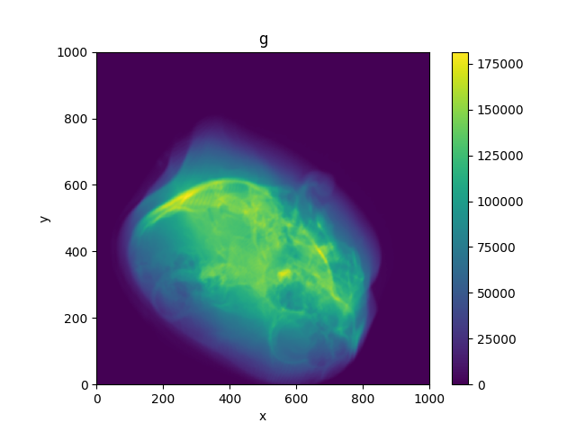

The associated fixed image (= 1/cos^2 alpha * d/ds R2\[cos gamma * g\])

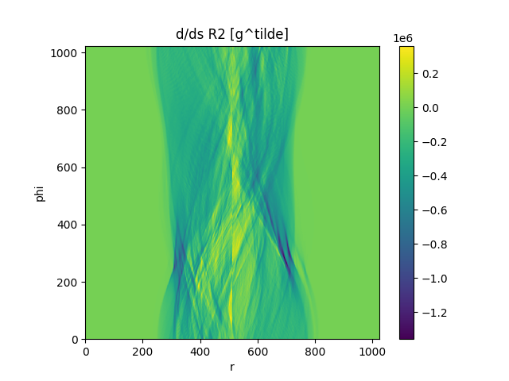

The 3D Radon transform of the volume data (= R3\[mu\]), resampled according to the ground truth transformation (this
should roughly
match the above image):

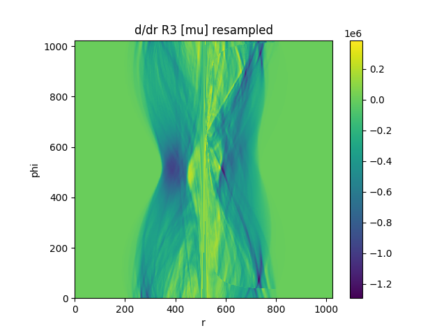

A plot of the -ZNCC landscape over 2 dimensions (two angular components of transformation) between the fixed image and
the resampled Radon-transformed volume, with the ground truth transformation at the centre:

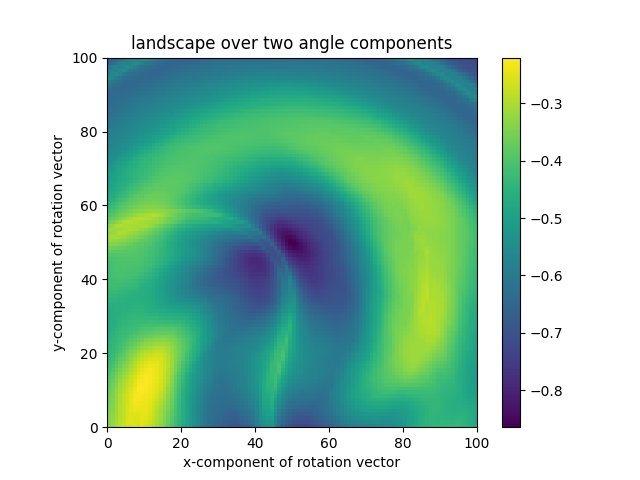

Starting from a different random transformation, optimising the ZNCC between these images over the transformation using
the Nelder-Mead algorithm:

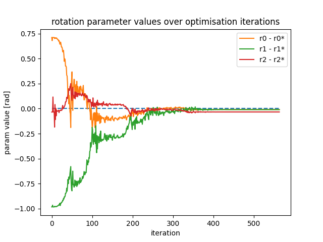
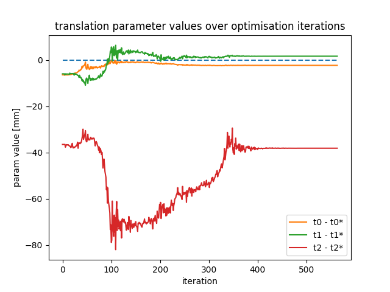
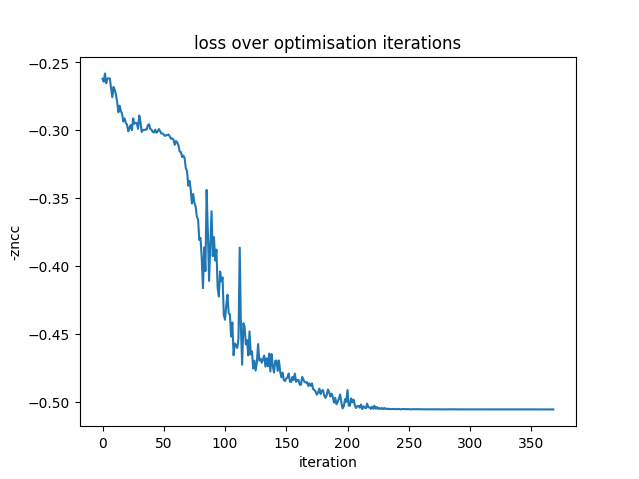

DRR generated at the converged transformation:

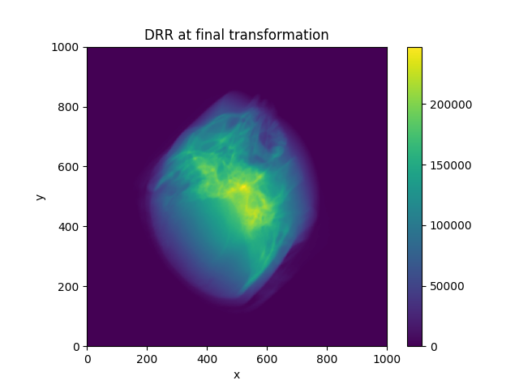

Optimisation completed in 1.429 seconds, performing a total of 564 function evaluations.

Here is a plot of the -ZNCC similarity between the fixed image and the resampled moving image against the distance in
SE3
between the transformation and the ground truth transformation for 1000 random transformations:

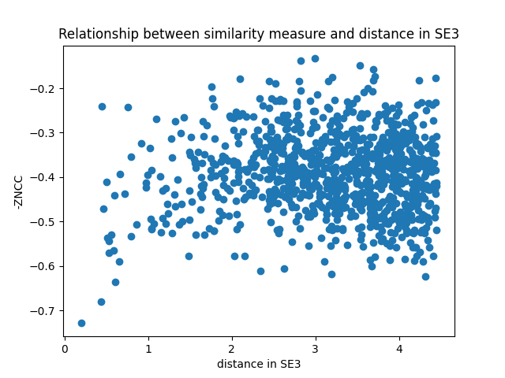

# Resampling

The 3D sinogram image is stored as a 3D grid of values, where the dimensions correspond to different values of phi,
theta and r. While this is very efficient for resampling, having the same number of value of phi for every value of
theta results in memory inefficiency and an extremely high densities of values near theta = +/- pi/2.

Smoothing the sampling consistently over S^2 to eliminate the second of these effects demonstrates that the line of
discontinuity visible in the resampling of the sinogram is due to this effect:

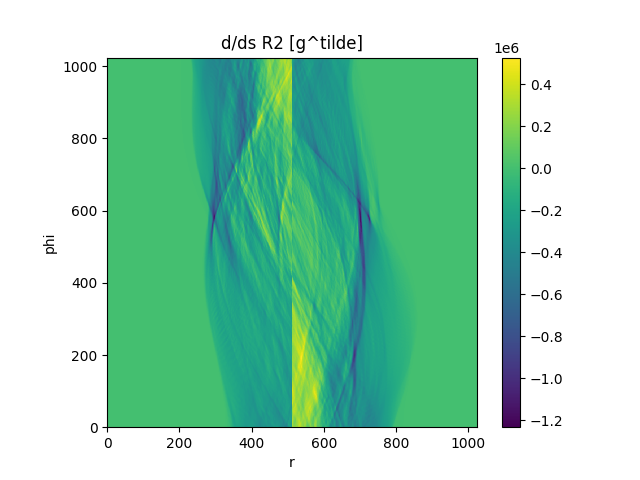
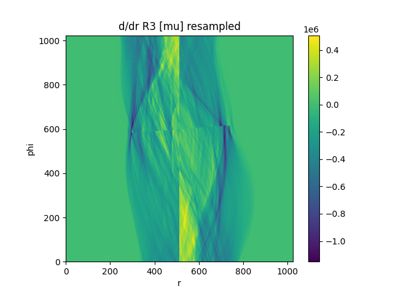
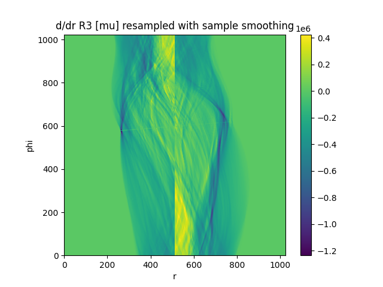

Although there is no significant difference manifest in the resulting optimisation landscape:

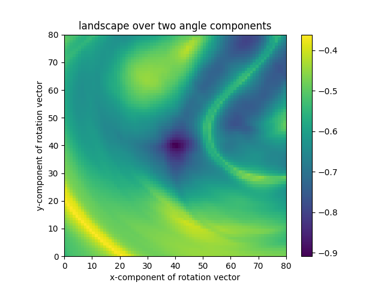
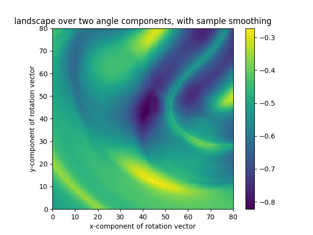

## IDE integration

All the following IDE integration advice is based on CLion 2024.3.1.1.

'Extension/CMakeLists.txt' exists exclusively to aid your IDE with syntax highlighting and error detection in the
extension .cpp and .cu source files. Configure a CMake project in your IDE to make use of this.

To use