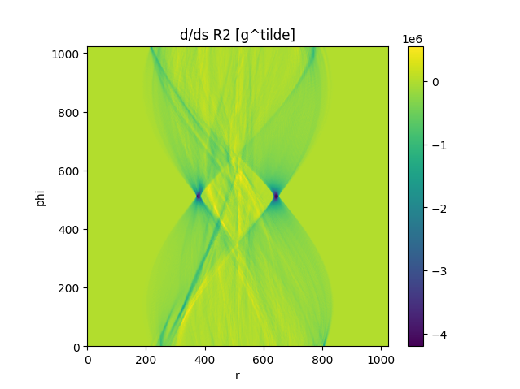
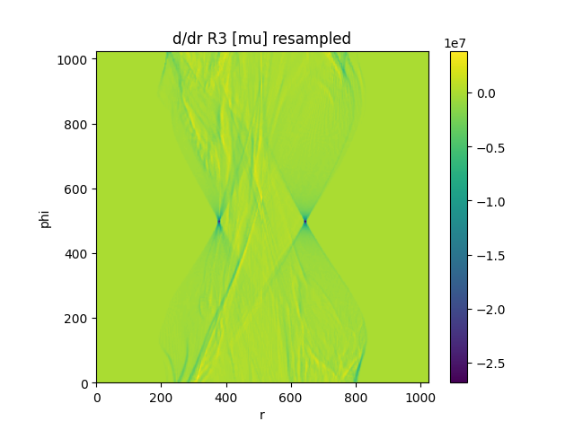

# CUDA-accelerated PyTorch extension for 2D/3D radiographic image registration using Grangeat's relation

Based on this paper:

Frysch R, Pfeiffer T, Rose G. A novel approach to 2D/3D registration of X-ray images using Grangeat's relation. Med Image Anal. 2021 Jan;67:101815. doi: 10.1016/j.media.2020.101815. Epub 2020 Sep 30. PMID: 33065470.

## Setup

CUDA is required. NVCC version information:
```bash
Cuda compilation tools, release 12.6, V12.6.85
Build cuda_12.6.r12.6/compiler.35059454_0
```

Create a Python environment:
```bash
python3.12 -m venv .venv
source .venv/bin/activate
```

Install requirements:
```bash
pip install -r requirements.txt
```

Build extension:
```bash
python setup.py develop
```
This will create a library file 'Extension/ExtensionTest.....so', which is imported by 'Extension/ops.py'.

See main.py for example use.


## Experiments so far

Creating a DRR from a CT image and calculating the fixed image:



Then calculating the Radon transform of the volume, and resampling according to Grangeat's relation:



A plot of the -ZNCC landscape over 2 dimensions (two angular components of transformation) between the fixed image and 
the resampled Radon-transformed volume, with the ground truth transformation at the centre:


## IDE integration

All the following IDE integration advice is based on CLion 2024.3.1.1.

'Extension/CMakeLists.txt' exists exclusively to aid your IDE with syntax highlighting and error detection in the
extension .cpp and .cu source files. Configure a CMake project in your IDE to make use of this.