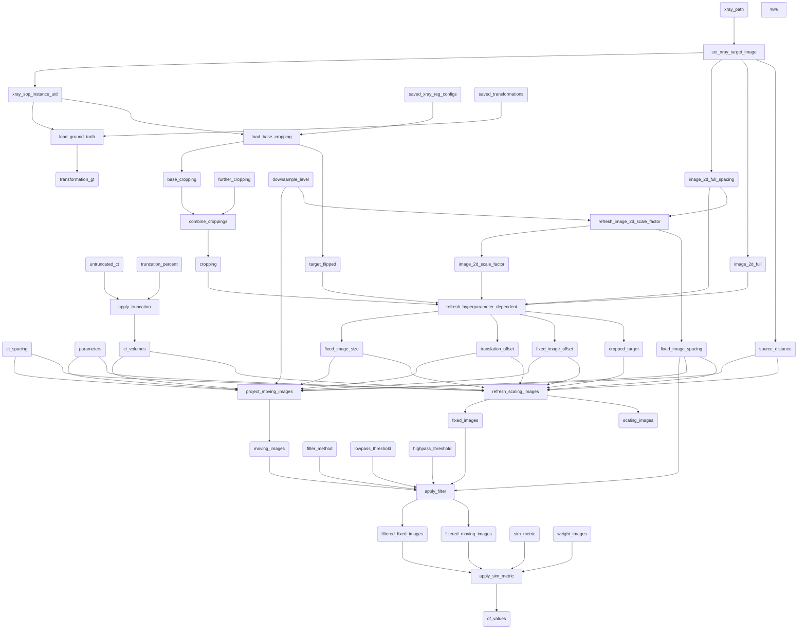

```mermaid
flowchart TD
    ct_spacing(ct_spacing)
    parameters(parameters)
    xray_path(xray_path)
%%

    apply_truncation[apply_truncation]
    untruncated_ct(untruncated_ct) ---> apply_truncation
    truncation_percent(truncation_percent) ---> apply_truncation
    apply_truncation ---> ct_volumes(ct_volumes)
%%

    set_xray_target_image[set_xray_target_image]
    xray_path ---> set_xray_target_image
    set_xray_target_image ---> source_distance(source_distance)
    set_xray_target_image ---> image_2d_full(image_2d_full)
    set_xray_target_image ---> image_2d_full_spacing(image_2d_full_spacing)
    set_xray_target_image ---> xray_sop_instance_uid(xray_sop_instance_uid)
%%

    combine_croppings[combine_croppings]
    base_cropping ---> combine_croppings
    further_cropping(further_cropping) ---> combine_croppings
    combine_croppings ---> cropping(cropping)
%%

    refresh_image_2d_scale_factor[refresh_image_2d_scale_factor]
    image_2d_full_spacing ---> refresh_image_2d_scale_factor
    downsample_level(downsample_level) ---> refresh_image_2d_scale_factor
    refresh_image_2d_scale_factor ---> fixed_image_spacing(fixed_image_spacing)
    refresh_image_2d_scale_factor ---> image_2d_scale_factor(image_2d_scale_factor)
%%
    
    load_base_cropping[load_base_cropping]
    xray_sop_instance_uid ---> load_base_cropping
    saved_xray_reg_configs(saved_xray_reg_configs) ---> load_base_cropping
    load_base_cropping ---> target_flipped(target_flipped)
    load_base_cropping ---> base_cropping(base_cropping)
%%

    refresh_hyperparameter_dependent[refresh_hyperparameter_dependent]
    image_2d_full ---> refresh_hyperparameter_dependent
    target_flipped ---> refresh_hyperparameter_dependent
    image_2d_full_spacing ---> refresh_hyperparameter_dependent
    cropping ---> refresh_hyperparameter_dependent
    image_2d_scale_factor ---> refresh_hyperparameter_dependent
    refresh_hyperparameter_dependent ---> cropped_target(cropped_target)
    refresh_hyperparameter_dependent ---> fixed_image_offset(fixed_image_offset)
    refresh_hyperparameter_dependent ---> translation_offset(translation_offset)
    refresh_hyperparameter_dependent ---> fixed_image_size(fixed_image_size)
%%

    load_ground_truth[load_ground_truth]
    saved_transformations(saved_transformations) ---> load_ground_truth
    xray_sop_instance_uid ---> load_ground_truth
    load_ground_truth ---> transformation_gt(transformation_gt)
%%

    refresh_scaling_images[refresh_scaling_images]
    parameters ---> refresh_scaling_images
    ct_volumes ---> refresh_scaling_images
    ct_spacing ---> refresh_scaling_images
    translation_offset ---> refresh_scaling_images
    source_distance ---> refresh_scaling_images
    fixed_image_spacing ---> refresh_scaling_images
    fixed_image_size ---> refresh_scaling_images
    fixed_image_offset ---> refresh_scaling_images
    cropped_target ---> refresh_scaling_images
    refresh_scaling_images --> scaling_images(scaling_images)
    refresh_scaling_images --> fixed_images(fixed_images)
%%

    project_moving_images[project_moving_images]
    parameters ---> project_moving_images
    ct_volumes ---> project_moving_images
    ct_spacing ---> project_moving_images
    source_distance ---> project_moving_images
    fixed_image_size ---> project_moving_images
    fixed_image_spacing ---> project_moving_images
    downsample_level ---> project_moving_images
    translation_offset ---> project_moving_images
    fixed_image_offset ---> project_moving_images
    project_moving_images ---> moving_images(moving_images)
%%
    
    apply_filter[apply_filter]
    filter_method(filter_method) ---> apply_filter
    moving_images ---> apply_filter
    fixed_images ---> apply_filter
    fixed_image_spacing ---> apply_filter
    lowpass_threshold(lowpass_threshold) ---> apply_filter
    highpass_threshold(highpass_threshold) ---> apply_filter
    apply_filter ---> filtered_moving_images(filtered_moving_images)
    apply_filter ---> filtered_fixed_images(filtered_fixed_images)
%%

    apply_sim_metric[apply_sim_metric]
    sim_metric(sim_metric) ---> apply_sim_metric
    filtered_fixed_images ---> apply_sim_metric
    filtered_moving_images ---> apply_sim_metric
    weight_images(weight_images) ---> apply_sim_metric
    apply_sim_metric ---> of_values(of_values)
```